## Лабораторная работа 1
### Задание 1
```python
name=input('Имя:')
age=int(input('Возраст:'))
print(f'Привет, {name}! Через год тебе будет {age+1}.')
```


### Задание 2
```python
a=float(input("a:").replace(',','.'))
b=float(input('b:').replace(',','.'))
print(f'sum={round(a+b,2)}; avg={round((a+b)/2,2)}')
```


### Задание 3
```python
price,discount,vat=map(float,input().split())
base=price*(1-discount/100)
vat_amount=base*(vat/100)
total=base+vat_amount
print(f'База после скидки: {base:.2f} P')
print(f'НДС: {vat_amount:.2f} P')
print(f'Итого к оплате: {total:.2f} P')
```


### Задание 4
```python
m=int(input())
hours,minutes=m//60,m%60
print(f'{hours}:{minutes:02d}')
```


### Задание 5
```python
name=input('ФИО:')
fio=name.split()
initials=[x[0].upper() for x in fio]
print(f'Инициалы: {''.join(initials)}.')
print(f'Длина (символов): {len(name.replace(' ',''))+2}')
```


### Задание 6
```python
n=int(input('Количество человек: '))
k_t=0
k_f=0
for x in range(n):
    info=input('')
    surname,name,age,tf=info.split()
    if tf=='True':
        k_t+=1
    if tf=='False':
        k_f+=1
print(k_t, k_f)
```


## Лабораторная работа 2
### Задание 1
```python
'''возвращает кортеж с минимальным и максимальным значениями списка'''
def min_max(nums: list[float | int]) -> tuple[float | int, float | int]:
    '''проверяем список на наличие элементов'''
    if len(nums)==0:
        return ValueError
    mx=-float('inf')
    mn=float('inf')
    for x in nums:
        if x>mx:
            mx=x
        if x<mn:
            mn=x
    return(mn,mx)
```


```python
'''возвращает отсортированный список уникальных значений'''
def unique_sorted(nums: list[float | int]) -> list[float | int]:
    return sorted(set(nums))
```


```python
'''расплющивает список списков/кортежей в один список по строкам'''
def flatten(mat: list[list | tuple]) -> list:
    res=[]
    for x in mat:
        '''проверяем тип элементов матрицы, если не список или кортеж - ошибка '''
        if not isinstance(x,(list,tuple)):
            return TypeError
        for y in x:
            res.append(y)
    return res        
```


### Задание 2

```python
'''меняет строки и столбцы местами'''
def transpose(mat: list[list[float | int]]) -> list[list]:
    '''если матрица нулевая - остается без изменений'''
    if len(mat)==0:
        return mat
    len_line=len(mat[0])
    len_column=len(mat)
    '''проверяю матрицу на прямоугольность'''
    for line in mat:
        if len(line)!=len_line:
            return ValueError
    '''создаю новую матрицу, меняя количество строк и столбцов'''
    new_mat=[[0 for x in range(len_column)] for y in range(len_line)]
    '''добавляю в новую матрицу значения оригинальной'''
    for x in range(len_column):
        for y in range(len_line):
            new_mat[y][x]=mat[x][y]
    return new_mat
```


```python
'''считает сумму по каждой строке'''
def row_sums(mat: list[list[float | int]]) -> list[float]:
    same_len=len(mat[0])
    sum_mat=[]
    '''проверяем матрицу на прямоугольность и записываю суммы строк в отдельный список'''
    for line in mat:
        if len(line)!=same_len:
            return ValueError
        sum_mat.append(sum(line))
    return sum_mat
```


```python
'''считает сумму по каждому столбцу'''
def col_sums(mat: list[list[float | int]]) -> list[float]:
    same_len=len(mat[0])
    sum_mat=[0]*same_len
    '''проверяем матрицу на прямоугольность'''
    for line in mat:
        if len(line)!=same_len:
            return ValueError
    '''суммирую элементы по столбцам и записываю суммы в отдельный список'''
    for x in range(same_len):
        for y in range(len(mat)):
            sum_mat[x]+=mat[y][x]
    return sum_mat
```


### Задание 3

```python
'''форматирует данные студента из кортежа в строку'''
def format_record(rec: tuple[str, str, float]) -> str:
    '''проверяем кортеж на наличие всех трех данных, если нет - ошибка'''
    if len(rec)!=3:
        return ValueError
    '''проверяем является ли первый элемент строкой, если нет - ошибка'''
    if isinstance(rec[0],str):
        full_name=rec[0].strip().split()
        '''проверяем наличие 2 или 3 слов в имени и форматирую , в иных случаях - ошибка'''
        if len(full_name)==3: 
            initials=f'{full_name[0][0].upper()}{full_name[0][1:]} {full_name[1][0].upper()}.{full_name[2][0].upper()}.'
        elif len(full_name)==2:
            initials=f'{full_name[0][0].upper()}{full_name[0][1:]} {full_name[1][0].upper()}.'
        else:
            return ValueError
    else:
        return TypeError
    
    '''проверяем является ли второй элемент строкой, если нет - ошибка'''
    if isinstance(rec[1],str):
        group=rec[1].strip()
        '''проверяем наличие группы, при отсутствии - ошибка'''
        if len(group)==0:
            return ValueError
    else:
        return TypeError

    gpa=rec[2]
    '''проверяем, принадлежит ли GPA типу float, если нет - ошибка'''
    if not isinstance(gpa,float):
        return TypeError
    
    '''записываем все отформатированные данные в одну строку'''
    result=f'{initials}, гр. {group}, GPA {gpa:.2f}'
    return result

```


## Лабораторная работа 3
### Задание А

```python
'''функция приводит строки в "нормальный" вид'''
def normalize(text: str, *, casefold: bool = True, yo2e: bool = True) -> str:
    if casefold:
        '''приводим к нижнему регистру'''
        text=text.casefold()
    if yo2e:
        '''заменяем ё на е'''
        text=text.replace('ё','е').replace('Ё','Е')
    '''убираем управляющие символы'''
    text=text.replace('/t',' ').replace('/r',' ').replace('/n',' ')
    '''убираем лишние пробелы'''
    text=' '.join(text.split())
    return (text)
```


```python
from re import *
'''функция разбивает строчки на "слова"'''
def tokenize(text: str) -> list[str]:
    '''шаблон для нужных нам подстрок'''
    pattern=r'\w+(?:-\w+)*'
    rez=findall(pattern,text)
    return rez
```


```python
'''функция создает словарь частот'''
def count_freq(tokens: list[str]) -> dict[str, int]:
    rez={}
    for words in tokens:
        rez[words]=rez.get(words,0)+1
    return rez
```


```python
'''функция создает топ n частот'''
def top_n(freq: dict[str, int], n: int = 5) -> list[tuple[str, int]]:
    dict_items=list(freq.items())
    '''создаем список сортированный по второму значению'''
    sorted_items=sorted([[-items[1],items[0]]for items in dict_items])
    rez=[]
    '''возвращаем значения на свое место'''
    for items in sorted_items:
        rez.append(((items[1],-items[0])))
    return rez[:n]

```


### Задание В

```python
import sys
'''добавляем нужный нам путь в список путей, где Python ищет модули при импорте'''
sys.path.append('C:/Users/dasha/Desktop/python_labs/src')
'''импортируем созданные ранее функции'''
from src.lib.text import normalize, tokenize, count_freq, top_n

'''функция считает слова, их частоты и выводит топ'''
def top_of_words(*, table: bool = True):
    '''читаем текст до EOF'''
    text = sys.stdin.read()
    '''проверяем текст на пустоту'''
    if text=='':
        return 'пустой текст'
    '''приводим текст в нормальный вид, разбиваем на слова и считаем их частоты'''
    normalized_text = normalize(text)
    tokens = tokenize(normalized_text)
    word_counts = count_freq(tokens)
    top = top_n(word_counts,5)
    print(f"Всего слов: {len(tokens)}")
    print(f"Уникальных слов: {len(set(tokens))}")
    '''выводим топ слов красивой табличкой'''
    if table:
        max_len=max(len(x) for x,y in top)
        if max_len<5:
            max_len=5
        first_line='слово'+' '*(max_len-5)+'| частота'
        print(first_line)
        print('-'*len(first_line))
        for word, count in top:
            print(f'{word}'+' '*(max_len-len(word))+f'| {count}')
    else:
        print("Топ-5:")
        for word, count in top:
            print(f"{word}:{count}")

top_of_words()

```


## Лабораторная работа 4

### Задание А

``` python
from pathlib import Path
def read_text(path: str | Path, encoding: str = "utf-8") -> str:
    '''
    Функция читает файл в указанной кодировке и возвращает его одной строкой.
    Чтобы поменять кодировку надо указать ее в параметрах функции, например: encoding="cp1251".
    Если файл не найден - поднимается FileNotFoundError.
    Если кодировка не подходит - поднимается UnicodeDecodeError.
    Если файл пустой - по умолчанию возаращается пустая строка.
    '''
    p=Path(path) #превращает входимый объект в path-объект
    return p.read_text(encoding=encoding) #читает текст в указаной кодировке
```


``` python
import csv
from pathlib import Path
from typing import Iterable, Sequence
def write_csv(rows: list[tuple | list], path: str | Path, header: tuple[str, ...] | None = None) -> None:
    '''
    Функция создает/перезаписывает CSV с разделителем ','.
    Если передан header(заголовок), он записывается первой строкой.
    Если строки в rows имеют разную длину, поднимается ValueError.
    При пустом rows и header=None создается пустой файл.
    При пустом rows и непустым header файл содержит только заголовок.
    '''
    p=Path(path)
    rows=list(rows)
    with p.open('w',newline='', encoding='utf-8') as f:
        w=csv.writer(f) #команда-помощник для записи csv файлов
        if header is not None:
            w.writerow(header) #запись заголовка
        if rows:
            if not all(len(x)==len(rows[0]) for x in rows): #проверка строчек на одинаковую длину
                raise ValueError
            for r in rows:
                    w.writerow(r) #запись строчек
```


``` python
def ensure_parent_dir(path: str | Path) -> None:
    '''функция находит родительскую директорию файла и при ее отсутствии добавляет'''
    p = Path(path)  
    if p.parent and not p.parent.exists(): 
        p.parent.mkdir(parents=True, exist_ok=True)
```
### Задание В

``` python
import sys
from io_txt_csv import read_text, write_csv #импортируем созданные ранее функции
sys.path.append('C:/Users/dasha/Desktop/python_labs/src')
from lib.text import normalize, tokenize, count_freq, top_n


try: #проверяем наличие файла
    text = read_text('data/lab04/input.txt')#считываем текст из файла 
except FileNotFoundError as e: #при его отсутсвии прерываем выполнение и выводим ошибку
    print(f"Ошибка: {e}") 
    sys.exit(1)

#делим текст на токены, составляем словарь частотт и выстраиваем топ
tokens = tokenize(normalize(text))
word_counts = count_freq(tokens)
top_5=top_n(word_counts,5) #топ-5 для вывода
top_list=top_n(word_counts, len(word_counts.keys())) #весь топ для записи в csv-файл
write_csv(top_list,'data/lab04/report.csv', ('word','count')) #записываем в csv-файл с заголовками word и count

#выводим количество слов в общем и уникальных
print(f"Всего слов: {len(tokens)}") 
print(f"Уникальных слов: {len(set(tokens))}")
#выводип топ-5 красивой табличкой
max_len=max(len(x) for x,y in top_5)
if max_len<5:
    max_len=5
first_line='слово'+' '*(max_len-5)+'| частота'
print(first_line)
print('-'*len(first_line))
for word, count in top_5:
    print(f'{word}'+' '*(max_len-len(word))+f'| {count}')

```


## Лабораторная работа 5

### Задание А

``` python 
from pathlib import Path
import json,csv,sys
sys.path.append('C:/Users/dasha/Desktop/python_labs/src')
from lab04.io_txt_csv import ensure_parent_dir

def json_to_csv(json_path: str, csv_path: str) -> None:
    '''Функция конвертирует JSON-файл в CSV-файл, проверяя синтаксис и корректность входного и создавая директорию(если надо) выходного'''
    j_path=Path(json_path)

    if not j_path.exists(): #проверяем наличие файла
        raise FileNotFoundError('Файл не найден')
    
    with open(j_path,'r',encoding='utf-8') as j_file: #открываем JSON-файл для чтения

        try:
            j_data=json.load(j_file) #загружаем данные из JSON-файла
        except json.JSONDecodeError: #проверяем синтаксис 
            raise ValueError("Пустой JSON или неподдерживаемая структура")
        
        if not j_data: #проверяем файл на пустоту
            raise ValueError('Файл JSON пуст')
        
        if not isinstance(j_data,list): #проверям тип данных(список)
            raise ValueError('Файл не является СПИСКОМ словарей')
        
        if not all(isinstance(row,dict) for row in j_data): #проверяем тип данных(словари)
            raise ValueError('Файл не является списком СЛОВАРЕЙ')
        
    c_path=Path(csv_path)
    ensure_parent_dir(c_path) #создаем родительскую директорию, если ее нет

    with open(c_path,'w',encoding='utf-8', newline='') as c_file: #открываем CSV-файл для записи
        c_writer=csv.DictWriter(c_file,fieldnames=j_data[0].keys()) #команда-помощник для записи CSV, заголовки-ключи первого словаря
        c_writer.writeheader() #записываем заголовки
        c_writer.writerows(j_data) #записываем данные


def csv_to_json(csv_path: str, json_path: str) -> None:
    '''Функция конвертирует CSV-файл в JSON-файл, проверяя синтаксис и корректность входного и создавая директорию(если надо) выходного'''
    c_path=Path(csv_path)

    if not c_path.exists(): #проверяем наличие файла
        raise FileNotFoundError('Файл не найден')
    if c_path.suffix != '.csv': #проверяем расширение файла
            raise ValueError("Неверный тип файла")
    
    with open(c_path,'r',encoding='utf-8') as c_file: #открываем CSV-файл для чтения
        c_data=csv.DictReader(c_file) #команда-помощник для чтения CSV
        if not c_data.fieldnames: #проверяем наличие заголовков
            raise ValueError('Файл пустой или в нем нет заголовков')
        c_rows=list(c_data)
        if not c_rows: #проверяем наличие данных
            raise ValueError('В файле есть заголовки, но нет данных')
        
    j_path=Path(json_path)
    ensure_parent_dir(j_path) #создаем родительскую директорию, если ее нет
    with open(j_path,'w', encoding='utf-8') as j_file: #открываем JSON-файл для записи
        json.dump(c_rows,j_file,ensure_ascii=False,indent=2) #записываем данные в JSON-файл с форматированием(кириллица и отступы)


```
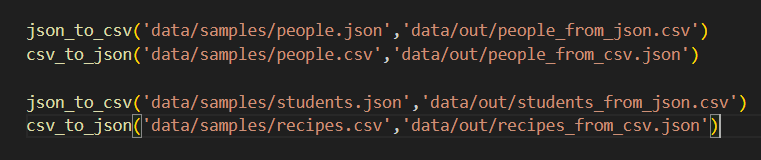
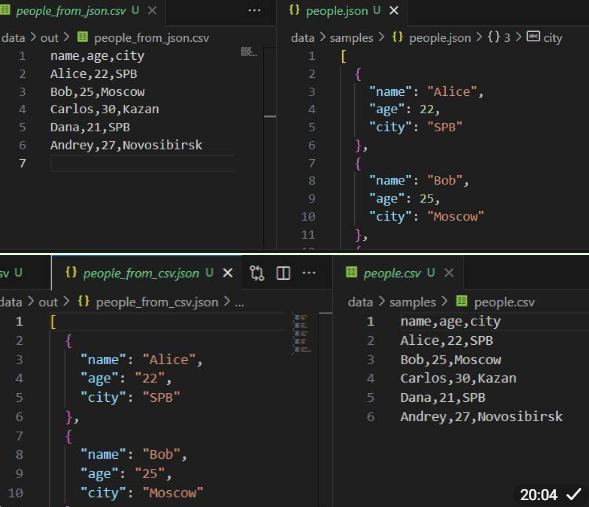
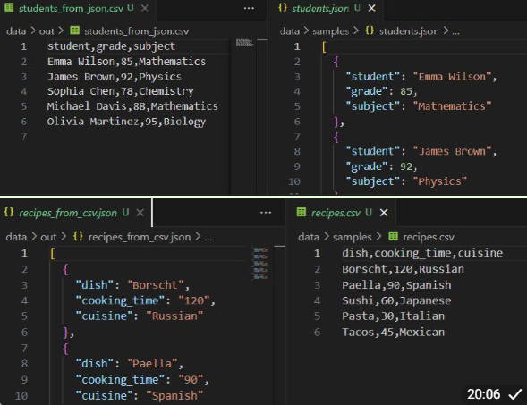

### Задание В

``` python
from openpyxl import Workbook #библиотека и функция для работы с Excel-файлами
from openpyxl.utils import get_column_letter # функция для преобразования номера колонки в букву
import csv,sys
from pathlib import Path
sys.path.append('C:/Users/dasha/Desktop/python_labs/src')
from lab04.io_txt_csv import ensure_parent_dir

def csv_to_xlsx(csv_path: str, xlsx_path: str) -> None:
    '''Функция конвертирует CSV-файл в XSLX-файл, проверяя синтаксис и корректность входного и создавая директорию(если надо) выходного'''
    c_path=Path(csv_path)
    
    if not c_path.exists(): #проверяем наличие файла
        raise FileNotFoundError('Файл не найден')
    if c_path.suffix != '.csv': #проверяем расширение файла
            raise ValueError("Неверный тип файла")
    
    wb = Workbook() #создание новой Excel-книги
    ws = wb.active #получение активного листа
    ws.title = "Sheet1" #установка названия листа

    with open(c_path,'r',encoding='utf-8') as c_file: #открываем CSV-файл для чтения
        c_data=csv.DictReader(c_file) #команда-помощник для чтения CSV
        if not c_data.fieldnames: #проверяем наличие заголовков
            raise ValueError('Файл пустой или в нем нет заголовков')     
        ws.append(c_data.fieldnames) #записываем заголовки в первую строку Excel
        for row in c_data: 
            ws.append([row[field] for field in c_data.fieldnames]) #записываем данные построчно в Excel

    x_path=Path(xlsx_path)
    ensure_parent_dir(x_path) #создаем родительскую директорию, если ее нет
    for column in ws.columns: #проходимся по каждой колонке листа
            max_length=8 #задаем значение минимальной ширины
            column_letter = get_column_letter(column[0].column) #получаем буквенное значение текущей колонки
            for cell in column: #проходимя по каждой ячейке колонки
                max_length = max(len(str(cell.value)), max_length) #обновляем максимальную длину(или нет)
            ws.column_dimensions[column_letter].width = max_length #устанавливаем максимальную ширину для данной колонки
    wb.save(x_path) #сохраяем Excel-файл

```

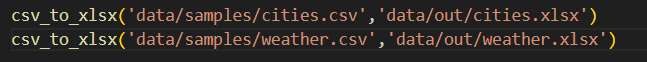
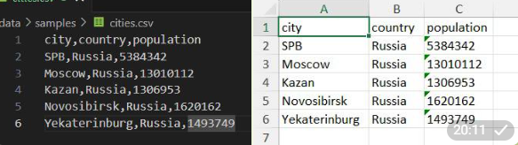
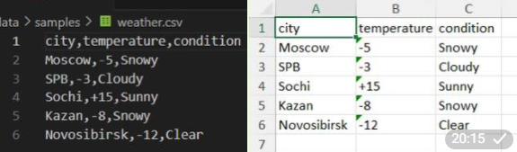

## Лабораторная работа 6

### Задание 1

``` python
import argparse #библиотека для обработки аргументов командной строки
from pathlib import Path
from src.lib.text import tokenize, count_freq, top_n

def main():
    parser = argparse.ArgumentParser(description="CLI‑утилиты лабораторной №6") #создаем главного парсера - анализатора аргументов командной строки
    subparsers = parser.add_subparsers(dest="command") #создаем механизм подкоманд, команды сохраняются в args.command

    cat_parser = subparsers.add_parser("cat", help="Вывести содержимое файла") #создаем парсер для подкоманды cat
    cat_parser.add_argument("--input", required=True) #добавляем обязательный аргумент input
    cat_parser.add_argument("-n", action="store_true", help="Нумеровать строки") #добавляем флаг n со значениями True/False

    stats_parser = subparsers.add_parser("stats", help="Частоты слов") #создаем парсер для подкоманды stats
    stats_parser.add_argument("--input", required=True) #добавляем обязательный аргумент input
    stats_parser.add_argument("--top", type=int, default=5) #добавляем числовой аргумент top со значением по умолчанию 5

    args = parser.parse_args() #парсинг аргументов командной строки и сохранение в объект args

    file_path=Path(args.input)
    if not file_path.exists(): #проверяем файл на существование
        parser.error('Файл не найден')

    if args.command == "cat": #обработка подкоманды cat
        with open(file_path,'r',encoding='utf-8') as f:
            number=0
            for lines in f:
                line=lines.rstrip('\n') #удаляем символ новой строки справа
                if args.n: #вывод строк с нумерацией при указании флага n
                    number+=1
                    print(f'{number}: {line}')
                else: #вывод строк без нумерации и флага
                    print(line)
    elif args.command == "stats": #обработка подкоманды stats
        if args.top <= 0: #проверка на положительность аргумента top
                parser.error("аргумент top - положительное число")
        with open(file_path,'r',encoding='utf-8') as f:
            lines=[i for i in f]
            if not lines: #проверка на пустоту файла
                parser.error("Файл пустой")
            tokens=tokenize(''.join(lines))
            frequency=count_freq(tokens)
            top_of_words=top_n(frequency,n=args.top)

            for word,count in top_of_words: #вывод топа слов
                print(f'{word}: {count}')

if __name__ == "__main__": #проверка для запуска файла напрямую или импортирования как модуль
    main()

```
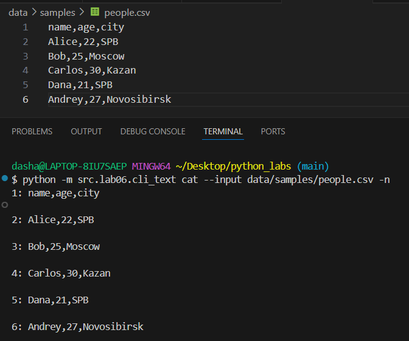
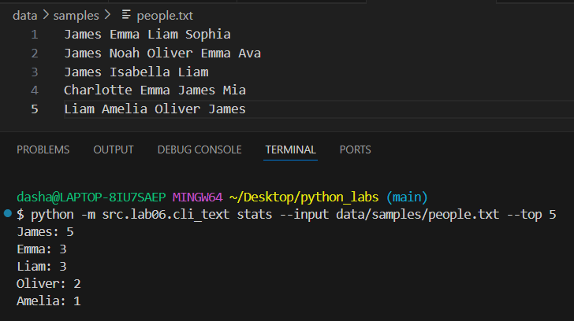


### Задание 2

``` python
import argparse #библиотека для обработки аргументов командной строки
from src.lab05.json_csv import json_to_csv, csv_to_json
from src.lab05.csv_xlsx import csv_to_xlsx

def main():
    parser = argparse.ArgumentParser(description="Конвертеры данных") #создаем главного парсера - анализатора аргументов командной строки
    sub = parser.add_subparsers(dest="cmd") #создаем механизм подкоманд, команды сохраняются в args.cmd

    p1 = sub.add_parser("json2csv", help='Конвертация из JSON в CSV') #создаем парсер для подкоманды json2csv
    p1.add_argument("--in", dest="input", required=True) #добавляем обязательный аргумент input
    p1.add_argument("--out", dest="output", required=True) #добавляем обязательный аргумент output

    p2 = sub.add_parser("csv2json", help='Конвертация из CSV в JSON') #создаем парсер для подкоманды csv2json
    p2.add_argument("--in", dest="input", required=True) #добавляем обязательный аргумент input
    p2.add_argument("--out", dest="output", required=True) #добавляем обязательный аргумент output

    p3 = sub.add_parser("csv2xlsx", help='Конвертация из CSV в XSLX') #создаем парсер для подкоманды csv2xslx
    p3.add_argument("--in", dest="input", required=True) #добавляем обязательный аргумент input
    p3.add_argument("--out", dest="output", required=True) #добавляем обязательный аргумент output

    args = parser.parse_args() #парсинг аргументов командной строки и сохранение в объект args
    if args.cmd == "json2csv": #обработка подкоманды json2csv
        json_to_csv(json_path=args.input, csv_path=args.output)
        
    elif args.cmd == "csv2json": #обработка подкоманды csv2json
        csv_to_json(csv_path=args.input, json_path=args.output)

    elif args.cmd == "csv2xlsx": #обработка подкоманды csv2xlsx
        csv_to_xlsx(csv_path=args.input, xlsx_path=args.output)


if __name__ == "__main__": #проверка для запуска файла напрямую или импортирования как модуль
    main()


```
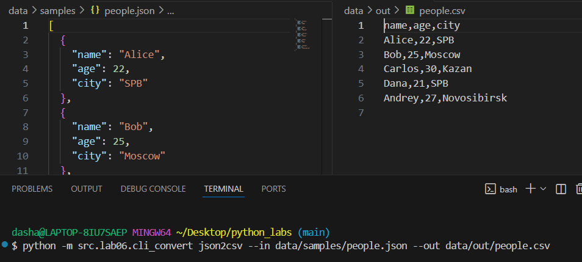
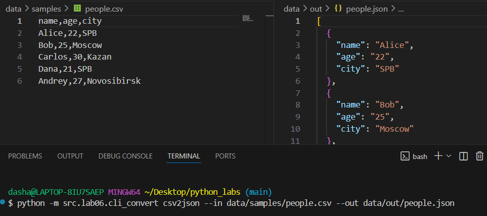
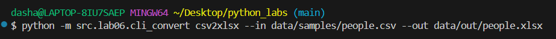
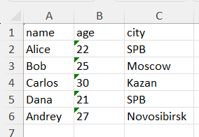


## Лабораторная работа 7

### Задание A

``` python
import pytest #библиотека pytest для создания и запуска тестов
from src.lib.text import normalize, tokenize, count_freq, top_n


@pytest.mark.parametrize( #параметризация для запуска одного теста с разными наборами данных
    "source, expected", #параметры: source - входной текст, expected - что должно получиться
    [
        ("ПрИвЕт\nМИр\t", "привет мир"), #разлиные тест-кейсы
        ("ёжик, Ёлка", "ежик, елка"),
        ("Hello\r\nWorld", "hello world"),
        ("  двойные   пробелы  ", "двойные пробелы"),
        ("", ""),
    ],
)
def test_normalize_basic(source, expected):
    '''функция теста для normalize, берет данные из параметризации'''
    assert normalize(source) == expected #проверяем что normalize(source) возвращает expected


@pytest.mark.parametrize( #параметризация для запуска одного теста с разными наборами данных
    "source,expected", #параметры: source - входной текст, expected - что должно получиться
    [
        ("привет мир", ["привет", "мир"]), #разлиные тест-кейсы
        ("hello,world!!!", ["hello", "world"]),
        ("по-настоящему круто", ["по-настоящему", "круто"]),
        ("2025 год", ["2025", "год"]),
        ("emoji 😀 не слово", ["emoji", "не", "слово"]),
        ("", []),
    ],
)
def test_tokenize_basic(source, expected):
    '''функция теста для tokenize, берет данные из параметризации'''
    assert tokenize(source) == expected #проверяем что tokenize(source) возвращает expected


def test_count_freq_and_top_n():
    '''тест проверяет вместе функции count_freq и top_n'''
    tokens = ["a", "b", "a", "c", "b", "a"]
    freq = count_freq(tokens)
    assert freq == {"a": 3, "b": 2, "c": 1} #обычный
    assert top_n(freq, 2) == [("a", 3), ("b", 2)] # обычный
    assert top_n(freq, 0) == [] #n=0
    assert top_n(freq, 5) == [("a", 3), ("b", 2), ("c", 1)] #n > количество элементов словаря
    assert count_freq([]) == {} #пустой список
    assert top_n({}, 5) == [] #пустой словарь


def test_top_n_tie_breaker():
    '''тест проверяет top_n с одинаковыми частотами'''
    freq = count_freq(["bb", "aa", "bb", "aa", "cc"])
    assert top_n(freq, 3) == [("aa", 2), ("bb", 2), ("cc", 1)]

```

### Задание B

``` python
import json, csv
from pathlib import Path
import pytest #библиотека pytest для создания и запуска тестов
from src.lab05.json_csv import json_to_csv, csv_to_json


def write_json(path: Path, obj): #вспомогательная функция для записи JSON файла
    path.write_text(json.dumps(obj, ensure_ascii=False, indent=2), encoding="utf-8")


def read_csv_rows(path: Path): #вспомогательная функция для чтения CSV файла
    with open(path, "r", encoding="utf-8") as f:
        return list(csv.DictReader(f))


def test_json_to_csv_roundtrip(tmp_path: Path):
    '''тест конвертации из JSON в CSV'''
    src = tmp_path / "people.json" #создаем временный путь к исходному JSON файлу
    dst = tmp_path / "people.csv"  #создаем временный путь к целевому CSV файлу
    data = [ #тестовые данные - список словарей
        {"name": "Alice", "age": 22},
        {"name": "Bob", "age": 25},
    ]
    write_json(src, data) #записываем тестовые данные в JSON файл
    json_to_csv(str(src), str(dst)) #вызов тестируемой функции
    rows = read_csv_rows(dst) #читаем результат CSV файла
    assert len(rows) == 2 #проверяем что в CSV 2 строки данных
    assert set(rows[0]) >= {"name", "age"} #проверяем что в первой строке есть заголовки


def test_csv_to_json_roundtrip(tmp_path: Path):
    '''тест конвертации из CSV в JSON'''
    src = tmp_path / "people.csv" #создаем временный путь к исходному CSV файлу
    dst = tmp_path / "people.json" #создаем временный путь к целевому JSON файлу
    src.write_text("name,age\nAlice,22\nBob,25\n", encoding="utf-8") #cоздаем CSV файл вручную как текст

    csv_to_json(str(src), str(dst)) #вызов тестируемой функции
    obj = json.loads(dst.read_text(encoding="utf-8")) #читаем результат JSON файла
    assert isinstance(obj, list) #результат должен быть списком
    assert len(obj) == 2 #в списке должно быть 2 элемента
    assert set(obj[0]) == {"name", "age"} #у первого элемента должны быть ключи "name" и "age"


def test_json_to_csv_empty_file(tmp_path: Path):
    '''Тест: пустой JSON файл должен вызывать ошибку'''
    src = tmp_path / "empty.json" #cоздаем путь к пустому JSON файлу
    dst = tmp_path / "output.csv" #cоздаем путь к целевому CSV файлу

    src.write_text("", encoding="utf-8") #cоздаем пустой файл

    with pytest.raises(ValueError): 
        json_to_csv(str(src), str(dst)) #функция json_to_csv должна выбросить ValueError


def test_csv_to_json_empty_file(tmp_path: Path):
    '''Тест: пустой CSV файл должен вызывать ошибку'''
    src = tmp_path / "empty.csv" #cоздаем путь к пустому CSV файлу
    dst = tmp_path / "output.json" #cоздаем путь к целевому JSON файлу


    src.write_text("", encoding="utf-8") #cоздаем пустой CSV файл

    with pytest.raises(ValueError):
        csv_to_json(str(src), str(dst)) #функция csv_to_json должна выбросить ValueError


def test_csv_to_json_only_headers(tmp_path: Path):
    '''Тест: CSV только с заголовками должен вызывать ошибку'''
    src = tmp_path / "headers_only.csv"  #CSV файл только с заголовками
    dst = tmp_path / "output.json" #целевой JSON файл

    src.write_text("name,age\n", encoding="utf-8")  #cоздаем CSV файл ТОЛЬКО с заголовком "name,age" и переносом строки

    with pytest.raises(ValueError): 
        csv_to_json(str(src), str(dst)) #функция csv_to_json должна выбросить ValueError


def test_missing_csv_raises():
    '''Тест: несуществующий CSV файл должен вызывать FileNotFoundError'''
    with pytest.raises(FileNotFoundError):
        csv_to_json("nope.csv", "out.json") #функция csv_to_json должна выбросить FileNotFoundError


def test_missing_json_raises():
    '''Тест: несуществующий JSON файл должен вызывать FileNotFoundError'''
    with pytest.raises(FileNotFoundError):
        json_to_csv("nope.json", "out.csv") #функция json_to_csv должна выбросить FileNotFoundError

```
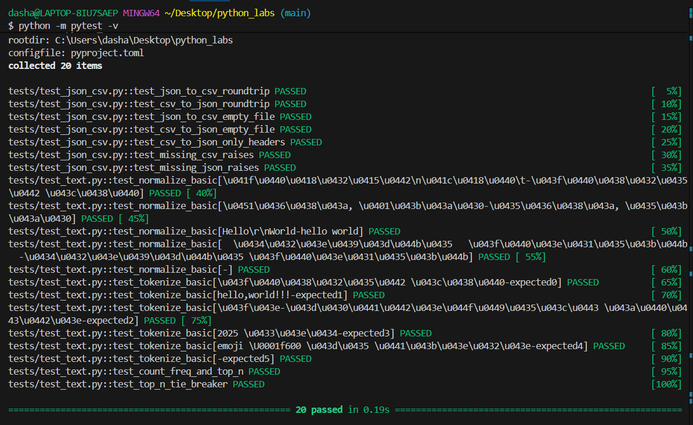
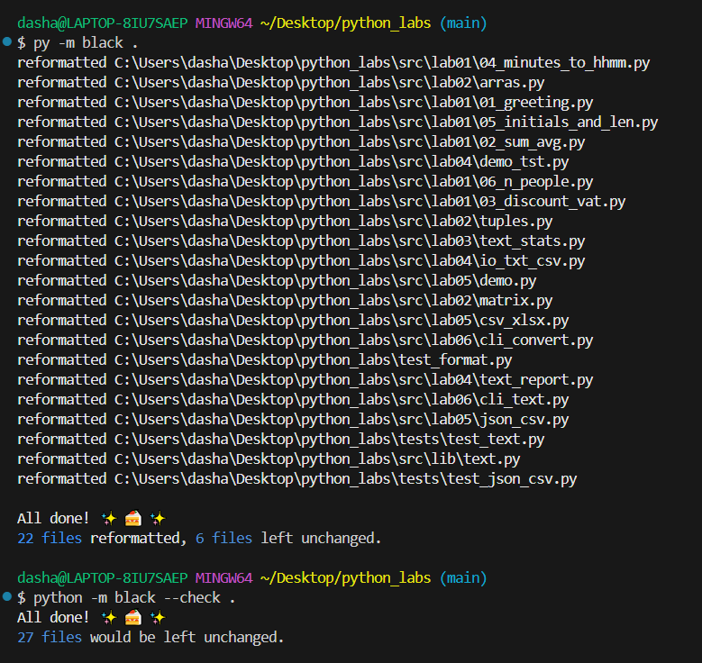
