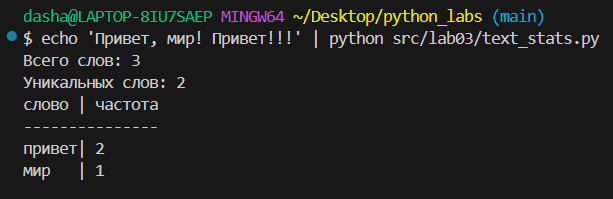

## Лабораторная работа 1
### Задание 1
```python
name=input('Имя:')
age=int(input('Возраст:'))
print(f'Привет, {name}! Через год тебе будет {age+1}.')
```


### Задание 2
```python
a=float(input("a:").replace(',','.'))
b=float(input('b:').replace(',','.'))
print(f'sum={round(a+b,2)}; avg={round((a+b)/2,2)}')
```


### Задание 3
```python
price,discount,vat=map(float,input().split())
base=price*(1-discount/100)
vat_amount=base*(vat/100)
total=base+vat_amount
print(f'База после скидки: {base:.2f} P')
print(f'НДС: {vat_amount:.2f} P')
print(f'Итого к оплате: {total:.2f} P')
```


### Задание 4
```python
m=int(input())
hours,minutes=m//60,m%60
print(f'{hours}:{minutes:02d}')
```


### Задание 5
```python
name=input('ФИО:')
fio=name.split()
initials=[x[0].upper() for x in fio]
print(f'Инициалы: {''.join(initials)}.')
print(f'Длина (символов): {len(name.replace(' ',''))+2}')
```


### Задание 6
```python
n=int(input('Количество человек: '))
k_t=0
k_f=0
for x in range(n):
    info=input('')
    surname,name,age,tf=info.split()
    if tf=='True':
        k_t+=1
    if tf=='False':
        k_f+=1
print(k_t, k_f)
```


## Лабораторная работа 2
### Задание 1
```python
'''возвращает кортеж с минимальным и максимальным значениями списка'''
def min_max(nums: list[float | int]) -> tuple[float | int, float | int]:
    '''проверяем список на наличие элементов'''
    if len(nums)==0:
        return ValueError
    mx=-float('inf')
    mn=float('inf')
    for x in nums:
        if x>mx:
            mx=x
        if x<mn:
            mn=x
    return(mn,mx)
```


```python
'''возвращает отсортированный список уникальных значений'''
def unique_sorted(nums: list[float | int]) -> list[float | int]:
    return sorted(set(nums))
```


```python
'''расплющивает список списков/кортежей в один список по строкам'''
def flatten(mat: list[list | tuple]) -> list:
    res=[]
    for x in mat:
        '''проверяем тип элементов матрицы, если не список или кортеж - ошибка '''
        if not isinstance(x,(list,tuple)):
            return TypeError
        for y in x:
            res.append(y)
    return res        
```


### Задание 2

```python
'''меняет строки и столбцы местами'''
def transpose(mat: list[list[float | int]]) -> list[list]:
    '''если матрица нулевая - остается без изменений'''
    if len(mat)==0:
        return mat
    len_line=len(mat[0])
    len_column=len(mat)
    '''проверяю матрицу на прямоугольность'''
    for line in mat:
        if len(line)!=len_line:
            return ValueError
    '''создаю новую матрицу, меняя количество строк и столбцов'''
    new_mat=[[0 for x in range(len_column)] for y in range(len_line)]
    '''добавляю в новую матрицу значения оригинальной'''
    for x in range(len_column):
        for y in range(len_line):
            new_mat[y][x]=mat[x][y]
    return new_mat
```


```python
'''считает сумму по каждой строке'''
def row_sums(mat: list[list[float | int]]) -> list[float]:
    same_len=len(mat[0])
    sum_mat=[]
    '''проверяем матрицу на прямоугольность и записываю суммы строк в отдельный список'''
    for line in mat:
        if len(line)!=same_len:
            return ValueError
        sum_mat.append(sum(line))
    return sum_mat
```


```python
'''считает сумму по каждому столбцу'''
def col_sums(mat: list[list[float | int]]) -> list[float]:
    same_len=len(mat[0])
    sum_mat=[0]*same_len
    '''проверяем матрицу на прямоугольность'''
    for line in mat:
        if len(line)!=same_len:
            return ValueError
    '''суммирую элементы по столбцам и записываю суммы в отдельный список'''
    for x in range(same_len):
        for y in range(len(mat)):
            sum_mat[x]+=mat[y][x]
    return sum_mat
```


### Задание 3

```python
'''форматирует данные студента из кортежа в строку'''
def format_record(rec: tuple[str, str, float]) -> str:
    '''проверяем кортеж на наличие всех трех данных, если нет - ошибка'''
    if len(rec)!=3:
        return ValueError
    '''проверяем является ли первый элемент строкой, если нет - ошибка'''
    if isinstance(rec[0],str):
        full_name=rec[0].strip().split()
        '''проверяем наличие 2 или 3 слов в имени и форматирую , в иных случаях - ошибка'''
        if len(full_name)==3: 
            initials=f'{full_name[0][0].upper()}{full_name[0][1:]} {full_name[1][0].upper()}.{full_name[2][0].upper()}.'
        elif len(full_name)==2:
            initials=f'{full_name[0][0].upper()}{full_name[0][1:]} {full_name[1][0].upper()}.'
        else:
            return ValueError
    else:
        return TypeError
    
    '''проверяем является ли второй элемент строкой, если нет - ошибка'''
    if isinstance(rec[1],str):
        group=rec[1].strip()
        '''проверяем наличие группы, при отсутствии - ошибка'''
        if len(group)==0:
            return ValueError
    else:
        return TypeError

    gpa=rec[2]
    '''проверяем, принадлежит ли GPA типу float, если нет - ошибка'''
    if not isinstance(gpa,float):
        return TypeError
    
    '''записываем все отформатированные данные в одну строку'''
    result=f'{initials}, гр. {group}, GPA {gpa:.2f}'
    return result

```


## Лабораторная работа 3
### Задание А

```python
'''функция приводит строки в "нормальный" вид'''
def normalize(text: str, *, casefold: bool = True, yo2e: bool = True) -> str:
    if casefold:
        '''приводим к нижнему регистру'''
        text=text.casefold()
    if yo2e:
        '''заменяем ё на е'''
        text=text.replace('ё','е').replace('Ё','Е')
    '''убираем управляющие символы'''
    text=text.replace('/t',' ').replace('/r',' ').replace('/n',' ')
    '''убираем лишние пробелы'''
    text=' '.join(text.split())
    return (text)
```


```python
from re import *
'''функция разбивает строчки на "слова"'''
def tokenize(text: str) -> list[str]:
    '''шаблон для нужных нам подстрок'''
    pattern=r'\w+(?:-\w+)*'
    rez=findall(pattern,text)
    return rez
```


```python
'''функция создает словарь частот'''
def count_freq(tokens: list[str]) -> dict[str, int]:
    rez={}
    for words in tokens:
        rez[words]=rez.get(words,0)+1
    return rez
```


```python
'''функция создает топ n частот'''
def top_n(freq: dict[str, int], n: int = 5) -> list[tuple[str, int]]:
    dict_items=list(freq.items())
    '''создаем список сортированный по второму значению'''
    sorted_items=sorted([[-items[1],items[0]]for items in dict_items])
    rez=[]
    '''возвращаем значения на свое место'''
    for items in sorted_items:
        rez.append(((items[1],-items[0])))
    return rez[:n]

```


### Задание В

```python
import sys
'''добавляем нужный нам путь в список путей, где Python ищет модули при импорте'''
sys.path.append('C:/Users/dasha/Desktop/python_labs/src')
'''импортируем созданные ранее функции'''
from src.lib.text import normalize, tokenize, count_freq, top_n

'''функция считает слова, их частоты и выводит топ'''
def top_of_words(*, table: bool = True):
    '''читаем текст до EOF'''
    text = sys.stdin.read()
    '''проверяем текст на пустоту'''
    if text=='':
        return 'пустой текст'
    '''приводим текст в нормальный вид, разбиваем на слова и считаем их частоты'''
    normalized_text = normalize(text)
    tokens = tokenize(normalized_text)
    word_counts = count_freq(tokens)
    top = top_n(word_counts,5)
    print(f"Всего слов: {len(tokens)}")
    print(f"Уникальных слов: {len(set(tokens))}")
    '''выводим топ слов красивой табличкой'''
    if table:
        max_len=max(len(x) for x,y in top)
        if max_len<5:
            max_len=5
        first_line='слово'+' '*(max_len-5)+'| частота'
        print(first_line)
        print('-'*len(first_line))
        for word, count in top:
            print(f'{word}'+' '*(max_len-len(word))+f'| {count}')
    else:
        print("Топ-5:")
        for word, count in top:
            print(f"{word}:{count}")

top_of_words()

```


## Лабораторная работа 4

### Задание А

``` python
from pathlib import Path
def read_text(path: str | Path, encoding: str = "utf-8") -> str:
    '''
    Функция читает файл в указанной кодировке и возвращает его одной строкой.
    Чтобы поменять кодировку надо указать ее в параметрах функции, например: encoding="cp1251".
    Если файл не найден - поднимается FileNotFoundError.
    Если кодировка не подходит - поднимается UnicodeDecodeError.
    Если файл пустой - по умолчанию возаращается пустая строка.
    '''
    p=Path(path) #превращает входимый объект в path-объект
    return p.read_text(encoding=encoding) #читает текст в указаной кодировке
```


``` python
import csv
from pathlib import Path
from typing import Iterable, Sequence
def write_csv(rows: list[tuple | list], path: str | Path, header: tuple[str, ...] | None = None) -> None:
    '''
    Функция создает/перезаписывает CSV с разделителем ','.
    Если передан header(заголовок), он записывается первой строкой.
    Если строки в rows имеют разную длину, поднимается ValueError.
    При пустом rows и header=None создается пустой файл.
    При пустом rows и непустым header файл содержит только заголовок.
    '''
    p=Path(path)
    rows=list(rows)
    with p.open('w',newline='', encoding='utf-8') as f:
        w=csv.writer(f) #команда-помощник для записи csv файлов
        if header is not None:
            w.writerow(header) #запись заголовка
        if rows:
            if not all(len(x)==len(rows[0]) for x in rows): #проверка строчек на одинаковую длину
                raise ValueError
            for r in rows:
                    w.writerow(r) #запись строчек
```


``` python
def ensure_parent_dir(path: str | Path) -> None:
    '''функция находит родительскую директорию файла и при ее отсутствии добавляет'''
    p = Path(path)  
    if p.parent and not p.parent.exists(): 
        p.parent.mkdir(parents=True, exist_ok=True)
```
### Задание В

``` python
import sys
from io_txt_csv import read_text, write_csv #импортируем созданные ранее функции
sys.path.append('C:/Users/dasha/Desktop/python_labs/src')
from lib.text import normalize, tokenize, count_freq, top_n


try: #проверяем наличие файла
    text = read_text('data/lab04/input.txt')#считываем текст из файла 
except FileNotFoundError as e: #при его отсутсвии прерываем выполнение и выводим ошибку
    print(f"Ошибка: {e}") 
    sys.exit(1)

#делим текст на токены, составляем словарь частотт и выстраиваем топ
tokens = tokenize(normalize(text))
word_counts = count_freq(tokens)
top_5=top_n(word_counts,5) #топ-5 для вывода
top_list=top_n(word_counts, len(word_counts.keys())) #весь топ для записи в csv-файл
write_csv(top_list,'data/lab04/report.csv', ('word','count')) #записываем в csv-файл с заголовками word и count

#выводим количество слов в общем и уникальных
print(f"Всего слов: {len(tokens)}") 
print(f"Уникальных слов: {len(set(tokens))}")
#выводип топ-5 красивой табличкой
max_len=max(len(x) for x,y in top_5)
if max_len<5:
    max_len=5
first_line='слово'+' '*(max_len-5)+'| частота'
print(first_line)
print('-'*len(first_line))
for word, count in top_5:
    print(f'{word}'+' '*(max_len-len(word))+f'| {count}')

```

